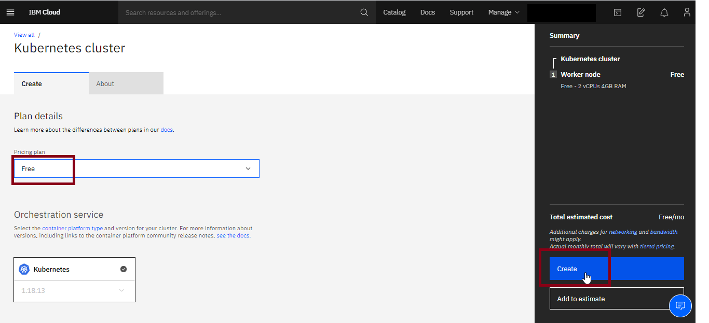
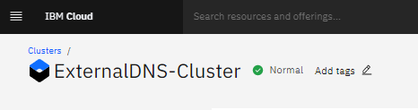
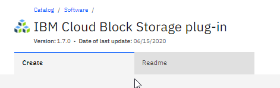
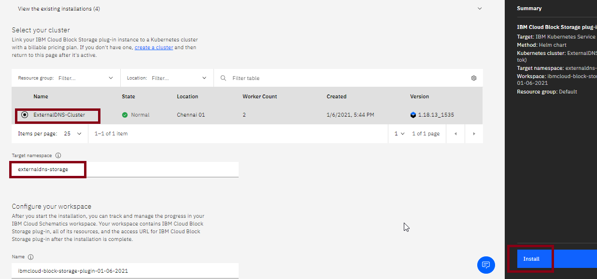
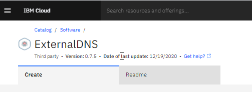
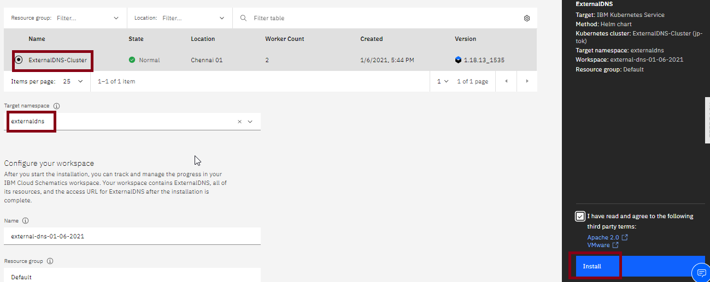
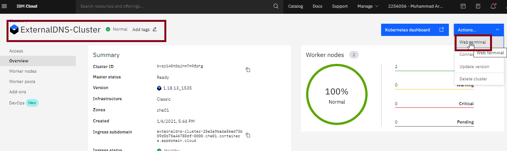
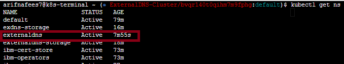
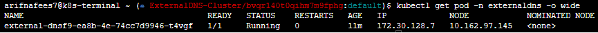
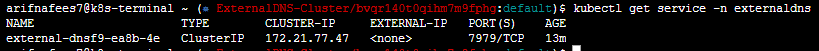

### Installing ExternalDNS on IBM Cloud
This document will describe how to install ExternalDNS on IBM Cloud using Kubernetes services.

### Contents

1. Introduction
2. Provision Kubernetes Cluster
3. Deploy IBM Cloud Block-Storage Plugin
4. Deploy ExternalDNS
5. Verifying the ExternalDNS Installation

### Introduction
To complete this tutorial, you should have an IBM Cloud account, if you do not have one, please [register/signup here](https://cloud.ibm.com/registration).
For installing ExternalDNS, we have used the Kubernetes cluster, and used the IBM Cloud Block-Storage plugin for our persistent volume. Upon the completion of this tutorial, you would have the ExternalDNS up and running on the Kubernetes cluster.

1. Provision the Kubernetes cluster, if you have already setup one, skip to step 2.
2. Deploy the IBM Cloud Block-Storage Plugin to the created cluster, if you have already done this, skip to step 3.
3. Deploy the ExternalDNS.

### Provision Kubernetes Cluster
* Click on the **Catalog** button on top center. Open [Catalog](https://cloud.ibm.com/catalog). 

* In search catalog box, search for **Kubernetes Service** and click on it. 

* You are now at Create Kubernetes Cluster page, there you have the two plans to create the Kubernetes cluster, either using **free plan** or **standard plan**.

**Option1- Using Free Plan:**
* Select Pricing Plan as “**Free**”. 
* Click on **Create**.
* Wait a few minutes, and then your Cloud would be ready.

>**Note**: _Please be careful when choosing free cluster, as your pods could be stuck at pending state due to insufficient compute and memory resources, if you face such kind of issue please increase your resource by creating them choosing the standard plan._

**Option2- Using Standard Plan:**
* Select Pricing Plan as “**Standard**” 
* Select your **Kubernetes Version** as latest available or desired one by application. In our example we have set it to be '**1.18.13**'. 

  

* Select Infrastructure as “**Classic**”

  

* Leave Resource Group to “**Default**”
* Select Geography as “**Asia**” or your desired one.
* Select Availability as “**Single Zone**”.
>_This option allows you to create the resources in either single or multi availability zones. Multi availability zone provides you the option to create the resources in more than one availability zones so in case of catastrophe, it could sustain the disaster and continues to work._
* Select Worker Zone as **Chennai 01**.
* In Worker Pool, input your desired number of nodes as “**2**” 
* Leave the Encrypt Local Disk option to “**On**”
* Select Master Service Endpoint to “**Both private and public endpoints**”
* Give your cluster-name as “**ExternalDNS-Cluster**”
* Provide tags to your cluster and click on **Create**.
* Wait a few minutes, and then your Cloud would be ready.

  

### Deploy IBM Cloud Block-Storage Plugin
* Click on the **Catalog** button on top center.
* In search catalog box, search for **IBM Cloud Block Storage Plug-In** and click on it 
* Select your cluster as "**ExternalDNS-Cluster**"
* Provide Target Namespace as “**externaldns-storage**”, leave name and resource group to **default values**. 
* Click on Install

### Deploy ExternalDNS
* Again go to the **Catalog** and search for **ExternalDNS**. 
  
  
  
* Provide the details as below. 

*	Target: **IBM Kubernetes Service**
*	Method: **Helm chart**
*	Kubernetes cluster: **ExternalDNS-Cluster(jp-tok)**
*	Target namespace: **externaldns**
*	Workspace: **external-dns-01-06-2021**
*	Resource group: **Default**
* Click on **Additional Parameters** with **Default Values**, you can set the deployment values or use the default ones, we have used the default in this example.

* Click on **Install**.

### Verifying the ExternalDNS Installation
* Go to the **Resources List** in the Left Navigation Menu and click on **Kubernetes** and then **Clusters** 
* Click on your created **ExternalDNS-Cluster**. 

  
  
* A screen would come up for your created cluster, click on **Actions**, and then **Web Terminal** 
* A warning will appear asking you to install the Web Terminal, click on **Install**.
* When the terminal is installed, click on the action button again and click on web terminal and type the following command in below command window. It will show you the workspaces of your cluster, you can see ExternalDNS active.

```sh
     $ kubectl get ns 
```

     
```sh  
     $ kubectl get pod –n Namespace –o wide 
```


```sh  
     $ kubectl get service –n Namespace 
```



The installation is done. Enjoy!
